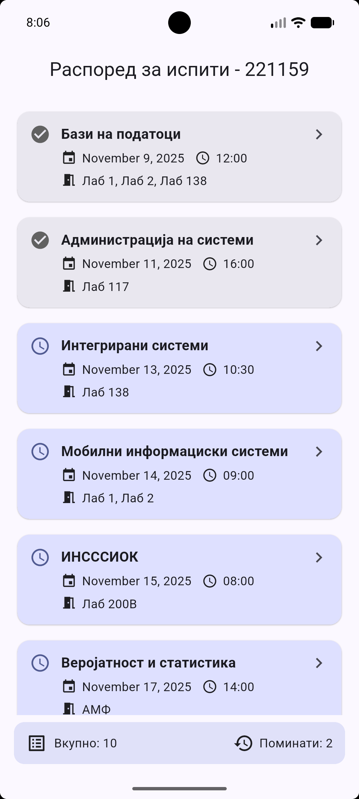
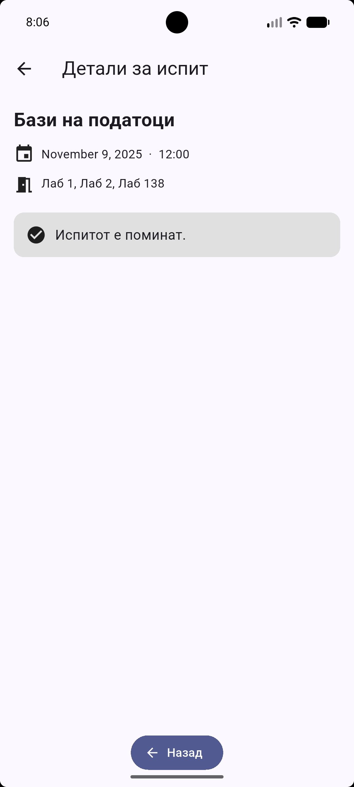

# Flutter Lab 1 - Распоред за испити

**Index:** 221159  
**Subject:** Мобилни информациски системи  
**Platform:** Flutter  
**Description:** Апликација за приказ на распоред за испити  

---

**Преглед на апликацијата**

- Прикажува листа од сите испити со предмет, датум, време и лабораторија.
- Испитите се сортирани хронолошки.
- Минатите испити се обележани со различна боја и икона.
- При клик на испит се отвора детална страна со преостанато време или порака дека испитот е поминат.
- На дното има преглед со вкупен број и број на поминати испити.

---

## Screenshots

| Exam List | Exam Detail Passed | Exam Detail Upcoming |
|------------------|--------------------------|----------------------------|
|  |  |  |
